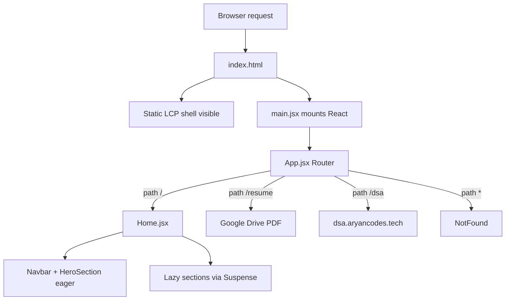

# Aryan Gupta — Portfolio Website

Personal portfolio for [aryancodes.tech](https://aryancodes.tech), built as a performance-focused React SPA with automated SEO and LCP (Largest Contentful Paint) optimization for strong Lighthouse and PageSpeed scores.

## Tech stack

| Layer | Technology |
|-------|------------|
| UI | React 18, Tailwind CSS 3, Framer Motion |
| Icons | lucide-react, react-icons |
| Routing | React Router 6 |
| Build | Vite 5 |
| Deploy | Vercel |
| Analytics | @vercel/analytics (lazy-loaded) |

## Prerequisites

- **Node.js** 20+ recommended
- **npm** (comes with Node)
- Optional: **cwebp** (for `npm run optimize:images`)

## Quick start

```bash
git clone <repo-url>
cd Portfolio-Website
npm install
npm run dev
```

Open [http://localhost:5173](http://localhost:5173).

Production build:

```bash
npm run build
npm run preview
```

## Scripts

| Script | Description |
|--------|-------------|
| `npm run dev` | Start Vite dev server with HMR |
| `npm run build` | Run SEO sync (`prebuild`) then production build |
| `npm run preview` | Serve the `dist/` output locally |
| `npm run sync:seo` | Inject meta, JSON-LD, LCP shell into `index.html` from `src/constants/seo.js` |
| `npm run optimize:images` | Generate WebP variants for hero and logos (requires `cwebp`) |
| `npm run generate:og` | Regenerate Open Graph preview image |
| `npm run lint` | ESLint across the project |

## Directory structure

```
Portfolio-Website/
├── index.html              # HTML shell; SEO/LCP blocks auto-injected at build
├── public/                 # Static files served at /
│   ├── fonts/              # (if any public font assets)
│   ├── project_images/     # Project preview images
│   ├── project_logos/      # Project logo SVGs/PNGs
│   ├── hero-photo*.webp    # LCP hero images
│   └── robots.txt, favicons, og-image.jpg
├── scripts/
│   ├── sync-seo.mjs        # Build-time SEO + LCP injection
│   ├── lcp-shell.mjs       # Critical CSS + static hero markup
│   ├── optimize-images.mjs
│   └── generate-og.mjs
├── src/
│   ├── main.jsx            # React entry; hides static LCP shell after mount
│   ├── App.jsx             # Router: /, /resume, /dsa, 404
│   ├── pages/
│   │   ├── Home.jsx        # Composes all sections (lazy below-fold)
│   │   └── NotFound.jsx
│   ├── components/         # Navbar, Hero, sections, shared UI
│   ├── constants/
│   │   ├── seo.js          # Meta, OG, JSON-LD, contact, social (SEO source of truth)
│   │   ├── urls.js         # Routes and external URLs
│   │   ├── assets.js       # Public image path constants
│   │   └── data/           # Section content (.jsx when entries include JSX)
│   ├── hooks/              # e.g. useCopyToClipboard
│   ├── motion/             # Shared Framer Motion variants
│   ├── styles/fonts.css    # Self-hosted @font-face rules
│   ├── assets/             # Bundled images (contact bg) and font files
│   └── index.css           # Tailwind + design tokens
├── vite.config.js          # Aliases, manual chunk splitting
├── vercel.json             # Redirects, cache headers, SPA rewrite
└── tailwind.config.mjs
```

## Request flow



1. **First paint:** `index.html` includes a static hero (LCP shell) and critical CSS injected by `sync-seo.mjs`.
2. **Hydration:** `main.jsx` mounts React and adds `app-mounted` on `body` to hide the static shell.
3. **Routing:** `App.jsx` serves the home page or redirects for `/resume` and `/dsa`.
4. **Home:** Navbar and Hero load immediately; Education, Experience, Projects, Honors, Positions, Contact, and Resume button load lazily.

## SEO / LCP pipeline

**Single source of truth:** [`src/constants/seo.js`](src/constants/seo.js)

At build time, `scripts/sync-seo.mjs` reads `seo.js` and injects into `index.html`:

- Meta title, description, keywords, canonical, Open Graph, Twitter cards
- JSON-LD structured data (`buildStructuredDataGraph()`)
- Hero image preload hints
- Critical CSS and static LCP HTML from `scripts/lcp-shell.mjs`

**Important:** Do not manually edit content between `<!-- SEO:AUTO_* -->` or `<!-- LCP_* -->` markers in `index.html`. Always change `seo.js` and run `npm run sync:seo` or `npm run build`.

Local SEO submission notes can live in `SEO_README.md` / `SEO_SUBMISSION_CHECKLIST.md` (gitignored).

## Design system

- **Tokens:** HSL variables in `src/index.css` (`--ink`, `--paper`, `--signal`, etc.)
- **Fonts:** Self-hosted in `src/assets/fonts/`, declared in `src/styles/fonts.css` — no Google Fonts CDN
- **Components:** Blueprint-style cards (`surface-card`, thick borders, offset shadows)

Agents and contributors should read [`.cursor/rules/portfolio-website.mdc`](.cursor/rules/portfolio-website.mdc) for full conventions.

## Contributing

### Before you start

1. Read this README and the Cursor rule in `.cursor/rules/`.
2. Run `npm install` and `npm run dev`.

### Making changes

| Change type | Where to edit |
|-------------|---------------|
| SEO / meta / schema | `src/constants/seo.js` → run `npm run sync:seo` |
| Résumé / DSA URLs | `src/constants/urls.js` |
| Contact email / social | `src/constants/seo.js` |
| New project | `src/constants/data/projects.js` + assets in `public/` |
| Experience / education copy | `src/constants/data/*.js` |
| Images | `public/` + `src/constants/assets.js`; run `optimize:images` for hero |

### Guidelines

- **Do not** change colors, visible copy, or layout unless the issue explicitly requires it.
- **Do** centralize new strings in `src/constants/`.
- **Do** run `npm run lint` and `npm run build` before opening a PR.
- **Do** keep below-fold sections lazy-loaded in `Home.jsx`.
- **Do not** add heavy UI libraries without discussion (bundle size affects Lighthouse).

### Performance review checklist

- [ ] Hero image: WebP, dimensions, `fetchpriority="high"`
- [ ] Other images: `loading="lazy"`, WebP where possible
- [ ] No new blocking scripts above the fold
- [ ] `npm run build` succeeds (SEO markers updated)
- [ ] Hash navigation links intact (`#education`, `#experience`, etc.)

## Deployment

Hosted on **Vercel**. [`vercel.json`](vercel.json):

- Long-cache headers for static assets (`/assets/`, images, fonts)
- SPA fallback: all routes → `index.html`

**Domains:** Use a single canonical host in Vercel (Project → Settings → Domains). Do not add a `www` → apex redirect in `vercel.json` if Vercel already redirects apex → `www` (that causes a redirect loop and a blank page). `SITE_URL` in `seo.js` must match the primary domain.

Push to the connected branch to deploy; no extra build command beyond `npm run build`.

## Agent documentation

- **Cursor rule:** `.cursor/rules/portfolio-website.mdc`
- **Agent skill:** `.cursor/skills/portfolio-website/SKILL.md`

These describe design language, constants usage, font/image maintenance, and Lighthouse-oriented workflows for AI-assisted development.